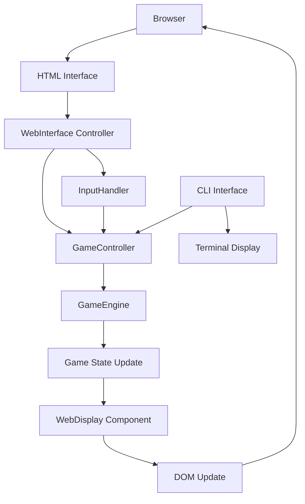

# Design Document

## Overview

This design outlines the implementation of browser support for the Burn Rate strategy game. The solution will create a web-based interface that reuses the existing game engine and logic while providing an intuitive browser experience. The architecture follows a modular approach where the core game logic remains unchanged, and new browser-specific UI components are added alongside the existing CLI interface.

## Architecture

### High-Level Architecture

```
┌─────────────────────────────────────────────────────────────┐
│                    Browser Environment                       │
├─────────────────────────────────────────────────────────────┤
│  Web UI Layer                                               │
│  ┌─────────────────┐  ┌─────────────────┐  ┌─────────────┐ │
│  │   HTML/CSS      │  │  WebInterface   │  │  WebDisplay │ │
│  │   Templates     │  │   Controller    │  │  Component  │ │
│  └─────────────────┘  └─────────────────┘  └─────────────┘ │
├─────────────────────────────────────────────────────────────┤
│  Shared Game Logic (Reused)                                │
│  ┌─────────────────┐  ┌─────────────────┐  ┌─────────────┐ │
│  │  GameEngine     │  │ GameController  │  │ InputHandler│ │
│  │  (unchanged)    │  │  (unchanged)    │  │ (unchanged) │ │
│  └─────────────────┘  └─────────────────┘  └─────────────┘ │
├─────────────────────────────────────────────────────────────┤
│  Build System                                              │
│  ┌─────────────────┐  ┌─────────────────┐                  │
│  │     Vite        │  │   TypeScript    │                  │
│  │   Bundler       │  │    Compiler     │                  │
│  └─────────────────┘  └─────────────────┘                  │
└─────────────────────────────────────────────────────────────┘
```

### Component Interaction Flow



## Components and Interfaces

### 1. WebInterface Controller

**Purpose:** Browser equivalent of CLIInterface, manages the web-based game loop and user interactions.

**Key Responsibilities:**
- Initialize and manage the web-based game session
- Handle DOM events and convert them to game commands
- Coordinate between user interface and game logic
- Manage game state updates and display refresh

**Interface:**
```typescript
export class WebInterface {
  constructor(gameEngine: GameEngine, config: WebConfig)
  public async start(): Promise<void>
  public stop(): void
  public handleUserAction(action: UserAction): Promise<void>
  public updateDisplay(): void
  public getGameEngine(): GameEngine
}

export interface WebConfig {
  containerId: string;
  showDebugInfo?: boolean;
  autoSave?: boolean;
  theme?: 'dark' | 'light';
}
```

### 2. WebDisplay Component

**Purpose:** Handles all visual rendering and DOM manipulation for the game interface.

**Key Responsibilities:**
- Render game state information (resources, fleets, turn info)
- Display combat results and game events
- Provide interactive elements for user commands
- Handle responsive design for different screen sizes

**Interface:**
```typescript
export class WebDisplay {
  constructor(config: WebDisplayConfig)
  public displayGameState(gameState: GameState): void
  public displayCombatResults(events: CombatEvent[]): void
  public displayError(message: string): void
  public displaySuccess(message: string): void
  public createCommandInterface(): HTMLElement
  public updateResourceDisplay(resources: Resources): void
}
```

### 3. WebInputHandler

**Purpose:** Manages user input from web interface elements and converts them to game commands.

**Key Responsibilities:**
- Handle form submissions for build orders
- Process attack fleet composition inputs
- Manage scan command selections
- Validate user inputs before processing

**Interface:**
```typescript
export class WebInputHandler {
  constructor(inputHandler: InputHandler)
  public handleBuildForm(formData: FormData): CommandResult
  public handleAttackForm(formData: FormData): CommandResult
  public handleScanSelection(scanType: ScanType): CommandResult
  public validateInput(input: any): ValidationResult
}
```

### 4. SessionManager (No Persistence)

**Purpose:** Controls session lifecycle for the browser environment without any persistent storage.

**Key Responsibilities:**
- Maintain in-memory game state only for the lifetime of the tab
- On reload or navigation, start a new game (permadeath, no saving)
- Provide explicit "Restart" control to begin a new run

**Interface:**
```typescript
export class SessionManager {
  public getCurrentState(): GameState
  public startNewGame(config?: Partial<WebGameConfig>): GameState
  public restart(): GameState
}
```

## Data Models

### Web-Specific Configuration

```typescript
interface WebGameConfig extends GameEngineConfig {
  webConfig: {
    containerId: string;
    theme: 'dark' | 'light';
    showAnimations: boolean;
    autoSave: boolean;
    showDebugInfo: boolean;
  };
}

interface UserAction {
  type: 'build' | 'attack' | 'scan' | 'endTurn' | 'newGame';
  data?: any;
  timestamp: number;
}

interface WebDisplayState {
  currentView: 'game' | 'combat' | 'settings' | 'help';
  selectedTab: string;
  showModal: boolean;
  modalContent?: string;
}
```

### HTML Structure

The web interface will use a structured HTML layout:

```html
<div id="burn-rate-game">
  <header class="game-header">
    <h1>Burn Rate</h1>
    <div class="turn-info">Turn: <span id="current-turn">1</span></div>
  </header>
  
  <main class="game-main">
    <section class="game-status">
      <div class="resources-panel"><!-- Resource display --></div>
      <div class="fleet-panel"><!-- Fleet information --></div>
    </section>
    
    <section class="game-actions">
      <div class="command-tabs">
        <button class="tab-button active" data-tab="build">Build</button>
        <button class="tab-button" data-tab="attack">Attack</button>
        <button class="tab-button" data-tab="scan">Scan</button>
      </div>
      
      <div class="command-panels">
        <div id="build-panel" class="command-panel active">
          <!-- Build interface -->
        </div>
        <div id="attack-panel" class="command-panel">
          <!-- Attack interface -->
        </div>
        <div id="scan-panel" class="command-panel">
          <!-- Scan interface -->
        </div>
      </div>
    </section>
    
    <section class="game-log">
      <div class="combat-log"><!-- Combat events --></div>
      <div class="system-messages"><!-- System messages --></div>
    </section>
  </main>
  
  <footer class="game-footer">
    <button id="end-turn-btn" class="primary-button">End Turn</button>
    <button id="help-btn" class="secondary-button">Help</button>
  </footer>
</div>
```

## Error Handling

### Browser-Specific Error Scenarios

1. **DOM Manipulation Errors:** Robust error handling for missing elements
2. **Navigation/Reload:** Detect unload/reload and communicate that runs are not saved
3. **Network Issues:** Handle potential future multiplayer scenarios
4. **Browser Compatibility:** Ensure compatibility with supported browsers

### Error Recovery Strategies

```typescript
class WebErrorHandler {
  public static handleDOMError(error: Error, element: string): void
  public static handleStorageError(error: Error): void
  public static handleGameStateError(error: Error): void
  public static displayUserFriendlyError(message: string): void
}
```

## Testing Strategy

### Unit Testing
- Test WebInterface controller methods
- Test WebDisplay rendering functions
- Test WebInputHandler command processing
- Test SessionManager lifecycle (no persistence)

### Integration Testing
- Test complete user workflows (build → attack → end turn)
- Test game state synchronization
- Test error handling scenarios
- Test responsive design on different screen sizes

### Browser Testing
- Cross-browser compatibility testing
- Mobile device testing
- Performance testing with large game states
- Accessibility testing for screen readers

### Test Structure
```
src/web/
├── __tests__/
│   ├── WebInterface.test.ts
│   ├── WebDisplay.test.ts
│   ├── WebInputHandler.test.ts
│   ├── GameStateManager.test.ts
│   └── integration/
│       ├── UserWorkflow.test.ts
│       └── ErrorHandling.test.ts
```

## Build and Deployment

### Build Configuration

The project will use Vite for building the web version:

```typescript
// vite.config.ts
export default defineConfig({
  build: {
    rollupOptions: {
      input: {
        main: 'src/web/index.html',
        cli: 'src/cli.ts'
      },
      output: {
        entryFileNames: '[name].js',
        chunkFileNames: '[name].js',
        assetFileNames: '[name].[ext]'
      }
    }
  },
  resolve: {
    alias: {
      '@': path.resolve(__dirname, 'src')
    }
  }
});
```

### Package.json Scripts

```json
{
  "scripts": {
    "build": "tsc && vite build",
    "build:cli": "tsc",
    "build:web": "vite build",
    "dev:web": "vite",
    "preview:web": "vite preview",
    "start:cli": "node dist/cli.js",
    "start:web": "npm run build:web && npm run preview:web"
  }
}
```

### File Structure

```
src/
├── web/                    # Browser-specific code
│   ├── index.html         # Main HTML entry point
│   ├── main.ts            # Web application entry point
│   ├── WebInterface.ts    # Main web controller
│   ├── WebDisplay.ts      # Display management
│   ├── WebInputHandler.ts # Input handling
│   ├── SessionManager.ts   # In-memory session lifecycle (no persistence)
│   ├── styles/            # CSS files
│   │   ├── main.css
│   │   ├── components.css
│   │   └── responsive.css
│   └── __tests__/         # Web-specific tests
├── ui/                    # Shared UI logic (existing)
│   ├── CLIInterface.ts    # CLI interface (unchanged)
│   ├── GameController.ts  # Shared controller (unchanged)
│   └── InputHandler.ts    # Shared input logic (unchanged)
├── engine/                # Game engine (unchanged)
└── models/                # Data models (unchanged)
```

## Performance Considerations

### Optimization Strategies

1. **Lazy Loading:** Load game components only when needed
2. **Virtual Scrolling:** For large combat logs and game history
3. **Debounced Updates:** Prevent excessive DOM updates during rapid state changes
4. **Efficient Rendering:** Use DocumentFragment for batch DOM updates

### Memory Management

```typescript
class PerformanceManager {
  private static readonly MAX_LOG_ENTRIES = 1000;
  private static readonly UPDATE_THROTTLE_MS = 16; // 60fps
  
  public static throttleUpdates(callback: Function): Function
  public static limitLogEntries(log: any[]): any[]
  public static cleanupResources(): void
}
```

## Security Considerations

### Client-Side Security

1. **Input Validation:** All user inputs validated before processing
2. **XSS Prevention:** Proper HTML escaping for dynamic content
3. **No Persistent Storage:** No localStorage/sessionStorage usage for game state
4. **Content Security Policy:** Implement CSP headers for production

### Data Protection

```typescript
class SecurityManager {
  public static sanitizeInput(input: string): string
  public static validateGameState(state: any): boolean
}
```

## Target Browser Support Matrix

- Safari (desktop) — last 2 major versions
- Chrome (desktop) — last 2 major versions
- iOS Safari — iOS 15+ (latest 2 major)
- Chrome on Android — Android 11+ (latest 2 major)

All other browsers are best-effort and not officially supported.

## Hosting and Deployment (AWS)

- Host static web build on AWS (S3 + CloudFront recommended)
- Configure CloudFront with appropriate cache policies and gzip/brotli
- Set CSP headers via CloudFront: default-src 'self'; script-src 'self'; style-src 'self' 'unsafe-inline'; img-src 'self' data:; connect-src 'self';
- Configure error responses to serve index.html on 404 (if SPA routing is used)